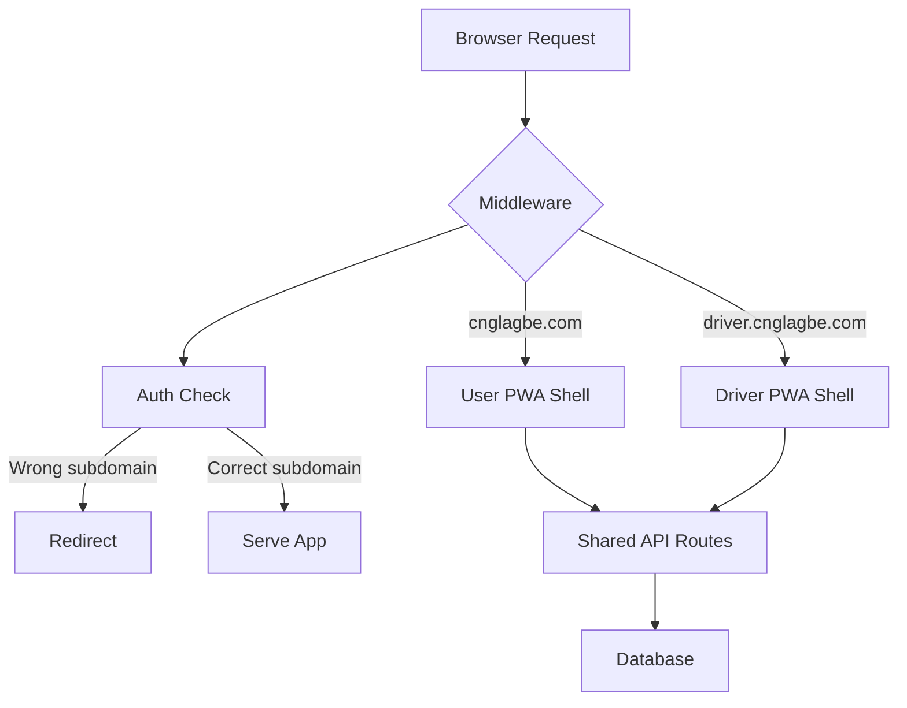

# Design Document: Subdomain-Based PWA Split

## Overview

This design implements subdomain-based routing for a Next.js monolith serving two distinct Progressive Web Apps: a user app at `cnglagbe.com` and a driver app at `driver.cnglagbe.com`. The solution uses Next.js middleware for subdomain detection and routing, shared authentication cookies across subdomains, and dynamic PWA manifest generation.

The architecture maintains a single codebase while providing distinct user experiences through subdomain-based routing, role-based access control, and separate PWA configurations.

## Architecture

### High-Level Architecture

```
Request Flow:
1. Browser → DNS → Server
2. Server → Middleware (subdomain detection)
3. Middleware → Role validation → Redirect (if needed)
4. Middleware → Route to appropriate PWA shell
5. Server → Render UI → Response
```

### Component Diagram



### Deployment Architecture

- Single Next.js application deployed to Vercel or Railway
- DNS configuration:
  - `cnglagbe.com` → A/CNAME record
  - `driver.cnglagbe.com` → A/CNAME record
- Both subdomains point to the same deployment
- Middleware handles routing based on host header

## Components and Interfaces

### 1. Middleware (`middleware.ts`)

**Location:** Root of project (`middleware.ts`)

**Purpose:** Intercept all requests, detect subdomain, validate user role, and route appropriately.

**Interface:**
```typescript
export function middleware(request: NextRequest): NextResponse | undefined
```

**Key Responsibilities:**
- Extract hostname from request headers
- Determine subdomain (user vs driver)
- Validate JWT token and extract role
- Redirect if user is on wrong subdomain
- Rewrite request to appropriate route
- Handle development environment (localhost)

**Pseudocode:**
```
function middleware(request):
  hostname = request.headers.get('host')
  
  // Determine subdomain
  subdomain = extractSubdomain(hostname)
  
  // Skip middleware for API routes and static files
  if isApiRoute(request.pathname) or isStaticFile(request.pathname):
    return next()
  
  // Get auth token
  token = request.cookies.get('auth-token')
  
  if token:
    userRole = decodeJWT(token).role
    
    // Role-based redirect
    if subdomain == 'user' and userRole == 'driver':
      return redirect('driver.cnglagbe.com' + request.pathname)
    
    if subdomain == 'driver' and userRole == 'user':
      return redirect('cnglagbe.com' + request.pathname)
  
  // Rewrite to appropriate app directory
  if subdomain == 'driver':
    return rewrite('/app/driver' + request.pathname)
  else:
    return rewrite('/app/user' + request.pathname)
```

**Configuration:**
```typescript
export const config = {
  matcher: [
    '/((?!api|_next/static|_next/image|favicon.ico|manifest.json).*)',
  ],
}
```

### 2. Subdomain Utility (`lib/subdomain.ts`)

**Purpose:** Centralized subdomain detection logic.

**Interface:**
```typescript
export function getSubdomain(hostname: string): 'user' | 'driver'
export function isDriverSubdomain(hostname: string): boolean
export function getUserSubdomainUrl(path: string): string
export function getDriverSubdomainUrl(path: string): string
```

**Implementation:**
```
function getSubdomain(hostname):
  // Handle localhost
  if hostname.startsWith('driver.localhost'):
    return 'driver'
  if hostname.startsWith('localhost'):
    return 'user'
  
  // Handle production
  if hostname.startsWith('driver.'):
    return 'driver'
  
  return 'user'

function isDriverSubdomain(hostname):
  return getSubdomain(hostname) == 'driver'

function getUserSubdomainUrl(path):
  baseUrl = process.env.NEXT_PUBLIC_USER_URL || 'https://cnglagbe.com'
  return baseUrl + path

function getDriverSubdomainUrl(path):
  baseUrl = process.env.NEXT_PUBLIC_DRIVER_URL || 'https://driver.cnglagbe.com'
  return baseUrl + path
```

### 3. Dynamic Manifest Route (`app/manifest.json/route.ts`)

**Purpose:** Serve subdomain-specific PWA manifests.

**Interface:**
```typescript
export async function GET(request: Request): Promise<Response>
```

**Implementation:**
```
function GET(request):
  hostname = request.headers.get('host')
  subdomain = getSubdomain(hostname)
  
  if subdomain == 'driver':
    manifest = {
      name: "CNGLagbe Driver",
      short_name: "CNG Driver",
      description: "Driver app for CNGLagbe",
      start_url: "/",
      display: "standalone",
      background_color: "#ffffff",
      theme_color: "#16A34A",
      icons: [
        {
          src: "/icons/driver-icon-192.png",
          sizes: "192x192",
          type: "image/png"
        },
        {
          src: "/icons/driver-icon-512.png",
          sizes: "512x512",
          type: "image/png"
        }
      ]
    }
  else:
    manifest = {
      name: "CNGLagbe",
      short_name: "CNGLagbe",
      description: "Book CNG rides easily",
      start_url: "/",
      display: "standalone",
      background_color: "#ffffff",
      theme_color: "#16A34A",
      icons: [
        {
          src: "/icons/user-icon-192.png",
          sizes: "192x192",
          type: "image/png"
        },
        {
          src: "/icons/user-icon-512.png",
          sizes: "512x512",
          type: "image/png"
        }
      ]
    }
  
  return Response(JSON.stringify(manifest), {
    headers: {
      'Content-Type': 'application/json',
      'Cache-Control': 'public, max-age=3600'
    }
  })
```

### 4. Client-Side App Role Hook (`hooks/useAppRole.ts`)

**Purpose:** Provide client-side components with current app role.

**Interface:**
```typescript
export function useAppRole(): 'user' | 'driver'
export function useIsDriverApp(): boolean
```

**Implementation:**
```
function useAppRole():
  [role, setRole] = useState<'user' | 'driver'>('user')
  
  useEffect(() => {
    if typeof window !== 'undefined':
      hostname = window.location.hostname
      detectedRole = getSubdomain(hostname)
      setRole(detectedRole)
  }, [])
  
  return role

function useIsDriverApp():
  role = useAppRole()
  return role == 'driver'
```

### 5. Auth Cookie Configuration (`lib/auth.ts`)

**Purpose:** Configure authentication cookies for cross-subdomain sharing.

**Interface:**
```typescript
export function setAuthCookie(token: string, response: Response): void
export function getAuthCookie(request: Request): string | null
export function clearAuthCookie(response: Response): void
```

**Implementation:**
```
function setAuthCookie(token, response):
  cookieOptions = {
    httpOnly: true,
    secure: process.env.NODE_ENV == 'production',
    sameSite: 'none',
    domain: '.cnglagbe.com',  // Leading dot for subdomain sharing
    maxAge: 60 * 60 * 24 * 7,  // 7 days
    path: '/'
  }
  
  response.cookies.set('auth-token', token, cookieOptions)

function getAuthCookie(request):
  return request.cookies.get('auth-token')?.value || null

function clearAuthCookie(response):
  response.cookies.delete('auth-token')
```

### 6. Environment Configuration

**Required Environment Variables:**
```
# Production
NEXT_PUBLIC_USER_URL=https://cnglagbe.com
NEXT_PUBLIC_DRIVER_URL=https://driver.cnglagbe.com
NEXT_PUBLIC_COOKIE_DOMAIN=.cnglagbe.com

# Development
NEXT_PUBLIC_USER_URL=http://localhost:3000
NEXT_PUBLIC_DRIVER_URL=http://driver.localhost:3000
NEXT_PUBLIC_COOKIE_DOMAIN=localhost

# JWT
JWT_SECRET=<secret-key>
```

## Data Models

### JWT Token Payload

```typescript
interface JWTPayload {
  userId: string
  role: 'user' | 'driver'
  email: string
  iat: number  // Issued at
  exp: number  // Expiration
}
```

### PWA Manifest Structure

```typescript
interface PWAManifest {
  name: string
  short_name: string
  description: string
  start_url: string
  display: 'standalone' | 'fullscreen' | 'minimal-ui' | 'browser'
  background_color: string
  theme_color: string
  icons: Array<{
    src: string
    sizes: string
    type: string
    purpose?: 'any' | 'maskable'
  }>
}
```

### Subdomain Configuration

```typescript
interface SubdomainConfig {
  hostname: string
  subdomain: 'user' | 'driver'
  baseUrl: string
  manifestPath: string
}
```

## Correctness Properties

*A property is a characteristic or behavior that should hold true across all valid executions of a system—essentially, a formal statement about what the system should do. Properties serve as the bridge between human-readable specifications and machine-verifiable correctness guarantees.*


### Property Reflection

After analyzing the acceptance criteria, I've identified the following consolidations:

- Properties 3.1-3.4 (cookie attributes) can be combined into a single comprehensive property that validates all cookie attributes at once
- Properties 4.1 and 4.2 (role-based redirects) can be combined into a single property that tests bidirectional redirects
- Properties 2.3, 2.4, and 2.5 (manifest structure) can be combined into a single property that validates the complete manifest structure
- Properties 6.2 and 6.3 (API route behavior) are related and can be tested together

### Correctness Properties

Property 1: Hostname extraction
*For any* HTTP request with a host header, extracting the hostname should return the exact value of the host header
**Validates: Requirements 1.1**

Property 2: Invalid subdomain handling
*For any* hostname that is not `cnglagbe.com`, `www.cnglagbe.com`, or `driver.cnglagbe.com`, the router should return a 404 response
**Validates: Requirements 1.4**

Property 3: Manifest structure completeness
*For any* subdomain (user or driver), the generated PWA manifest should contain all required fields (name, short_name, description, start_url, display, background_color, theme_color, icons) with unique values per subdomain
**Validates: Requirements 2.3, 2.4, 2.5**

Property 4: Auth cookie configuration
*For any* authentication cookie created by the system, it should have domain set to `.cnglagbe.com`, httpOnly set to true, secure set to true, and sameSite set to None
**Validates: Requirements 3.1, 3.2, 3.3, 3.4**

Property 5: Cross-subdomain authentication
*For any* valid authentication cookie, making requests to both `cnglagbe.com` and `driver.cnglagbe.com` should successfully authenticate the user
**Validates: Requirements 3.5**

Property 6: Role-based subdomain redirects
*For any* authenticated user, accessing a subdomain that doesn't match their role (driver on user subdomain or user on driver subdomain) should result in a redirect to the correct subdomain
**Validates: Requirements 4.1, 4.2**

Property 7: Public route access
*For any* unauthenticated request to a public route, the router should allow access regardless of subdomain
**Validates: Requirements 4.3**

Property 8: Path preservation during redirect
*For any* path being redirected between subdomains, the path component should remain unchanged in the redirect URL
**Validates: Requirements 4.5**

Property 9: Client-side role detection
*For any* hostname value, the role detector should return "driver" if the hostname starts with "driver." and "user" otherwise
**Validates: Requirements 5.1**

Property 10: Shared API routing
*For any* API route path, requests from both `cnglagbe.com` and `driver.cnglagbe.com` should route to the same API handler
**Validates: Requirements 6.1**

Property 11: API route redirect bypass
*For any* API route request, role-based redirects should not be applied regardless of user role or subdomain mismatch
**Validates: Requirements 6.2, 6.3**

Property 12: CORS header configuration
*For any* API response, appropriate CORS headers should be set to allow cross-subdomain requests
**Validates: Requirements 6.4**

Property 13: API role-based authorization
*For any* protected API route, authorization should be enforced based on user role independently of which subdomain the request originated from
**Validates: Requirements 6.5**

Property 14: Layout differentiation
*For any* page request, the user subdomain should serve user-specific layouts and the driver subdomain should serve driver-specific layouts
**Validates: Requirements 8.1**

## Error Handling

### Middleware Error Handling

1. **Invalid Hostname**: Return 404 for unrecognized hostnames
2. **JWT Decode Failure**: Treat as unauthenticated user, allow access to public routes
3. **Missing Environment Variables**: Log error and fall back to default values
4. **Redirect Loop Detection**: Implement redirect count limit (max 3 redirects)

### Manifest Generation Error Handling

1. **Invalid Subdomain**: Return default user manifest
2. **Missing Icon Files**: Log warning, include fallback icons
3. **Malformed Manifest**: Return valid minimal manifest structure

### Auth Cookie Error Handling

1. **Cookie Set Failure**: Log error, return error response to client
2. **Domain Mismatch**: Log warning, attempt to set cookie anyway
3. **Expired Token**: Clear cookie and treat as unauthenticated

### Client-Side Error Handling

1. **Window Undefined (SSR)**: Return default "user" role
2. **Invalid Hostname**: Default to "user" role
3. **Hook Initialization Failure**: Log error, return "user" role

## Testing Strategy

### Dual Testing Approach

This feature requires both unit tests and property-based tests for comprehensive coverage:

- **Unit tests**: Verify specific subdomain examples, edge cases (localhost, www prefix), and error conditions
- **Property tests**: Verify universal properties across all possible hostnames, roles, and paths

### Property-Based Testing Configuration

- Use `fast-check` library for TypeScript property-based testing
- Configure each test to run minimum 100 iterations
- Each property test must reference its design document property
- Tag format: **Feature: subdomain-pwa-split, Property {number}: {property_text}**

### Unit Testing Focus

Unit tests should cover:
- Specific hostname examples (`cnglagbe.com`, `www.cnglagbe.com`, `driver.cnglagbe.com`)
- Development environment hostnames (`localhost:3000`, `driver.localhost:3000`)
- Edge cases (missing host header, malformed hostnames)
- Integration between middleware and auth system
- Manifest generation for both subdomains
- Cookie configuration in different environments

### Property Testing Focus

Property tests should cover:
- Hostname extraction for all valid HTTP requests
- Role-based redirects for all user/role/subdomain combinations
- Path preservation for all possible paths during redirects
- Cookie configuration for all authentication scenarios
- API routing for all API paths from all subdomains
- Manifest structure validation for all subdomains

### Test Environment Setup

```typescript
// Test utilities
function createMockRequest(hostname: string, path: string, cookies?: Record<string, string>): NextRequest
function createMockJWT(role: 'user' | 'driver', userId: string): string
function extractCookieAttributes(response: NextResponse): CookieAttributes
```

### Example Property Test

```typescript
import fc from 'fast-check'

// Feature: subdomain-pwa-split, Property 8: Path preservation during redirect
test('path is preserved during subdomain redirects', () => {
  fc.assert(
    fc.property(
      fc.webPath(), // Generate random valid paths
      fc.constantFrom('user', 'driver'), // Generate roles
      (path, role) => {
        const wrongSubdomain = role === 'driver' ? 'cnglagbe.com' : 'driver.cnglagbe.com'
        const request = createMockRequest(wrongSubdomain, path, {
          'auth-token': createMockJWT(role, 'test-user')
        })
        
        const response = middleware(request)
        
        if (response && response.status === 307) {
          const redirectUrl = new URL(response.headers.get('location')!)
          expect(redirectUrl.pathname).toBe(path)
        }
      }
    ),
    { numRuns: 100 }
  )
})
```

## Implementation Notes

### Next.js Middleware Limitations

- Middleware runs on Edge Runtime, which has limited Node.js API access
- Cannot use `fs` module or other Node.js-specific APIs
- JWT verification must use Edge-compatible libraries (e.g., `jose`)
- Keep middleware logic lightweight to minimize cold start times

### PWA Configuration

- Existing `next-pwa` configuration in `next.config.ts` needs to be updated
- Service worker should be generated per subdomain
- Cache strategies should be identical for both apps
- Consider separate service worker files for each subdomain

### Development Workflow

- Use `/etc/hosts` file to map `driver.localhost` to `127.0.0.1`
- Or use browser extensions that support subdomain simulation
- Environment variables should have development defaults
- Middleware should log subdomain detection in development mode

### Deployment Considerations

- Vercel: Automatic subdomain support, no additional configuration needed
- Railway: May require custom domain configuration
- Ensure DNS records are properly configured for both subdomains
- SSL certificates must cover both subdomains (wildcard cert recommended)

### Security Considerations

- SameSite=None requires Secure flag (HTTPS only)
- Validate JWT signature on every request
- Implement rate limiting per subdomain
- Consider CSRF protection for state-changing operations
- Audit log subdomain access patterns for anomaly detection
