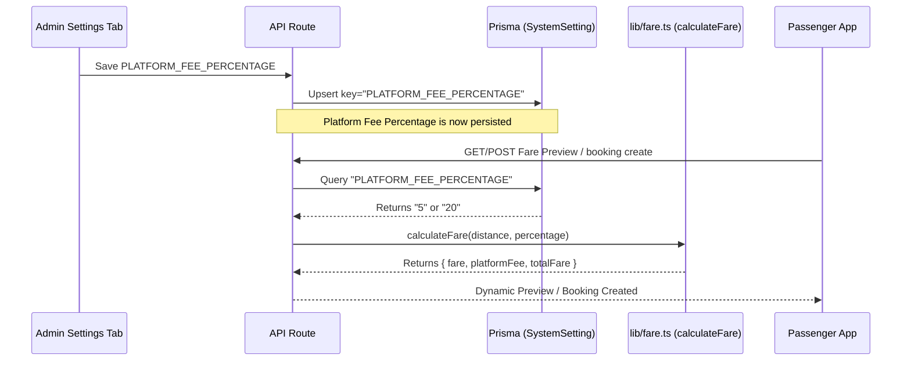

# Design Document: Dynamic Platform Fee

## Goal
Make the booking platform fee dynamic. Instead of being hardcoded to 5% in the utility helper, it will read a percentage setting `PLATFORM_FEE_PERCENTAGE` dynamically from the database. It will fallback to `5%` if the setting is absent. Administrators will be able to edit this setting directly within the Admin Settings tab.

## Proposed Architecture



## Detailed Changes

### 1. Utility Layer (`lib/fare.ts`)
Refactor the `calculateFare` function signature:
```typescript
export function calculateFare(distanceKm: number, platformFeePercentage: number = 5) {
  const BASE_FARE = 100;
  const PER_KM_RATE = 15;

  const fare = Math.round(BASE_FARE + distanceKm * PER_KM_RATE);
  const platformFee = Math.max(10, Math.round(fare * (platformFeePercentage / 100)));
  const totalFare = fare + platformFee;

  return {
    fare,
    platformFee,
    totalFare
  };
}
```

### 2. API Routes
- **`app/api/fare/calculate/route.ts`**: Query database settings and pass retrieved `PLATFORM_FEE_PERCENTAGE` to `calculateFare`.
- **`app/api/booking/create/route.ts`**: Query database settings and pass retrieved `PLATFORM_FEE_PERCENTAGE` to `calculateFare` during booking creation.

### 3. Database Seeding (`prisma/seed.ts`)
Add standard seed item for the platform fee percentage to ensure consistent baseline configurations:
```typescript
await tx.systemSetting.upsert({
  where: { key: "PLATFORM_FEE_PERCENTAGE" },
  update: {},
  create: { key: "PLATFORM_FEE_PERCENTAGE", value: "5" }
});
```

### 4. Admin Settings UI (`app/admin/components/tabs/SettingsTab.tsx`)
- Display the platform fee percentage input card/row.
- Enforce valid range (`0` to `100`).
- Wire to `handleUpdateSetting` callback to save changes in real time.

### 5. Translation Mappings (`constants/text.ts`)
Map appropriate labels and descriptions for both English and Bengali UI users:
- `platform_fee_percentage`: Platform Fee Percentage / প্ল্যাটফর্ম ফি শতকরা হার
- `platform_fee_percentage_desc`: Dynamic platform fee percentage applied to bookings / বুকিংয়ে প্রয়োগ করা প্ল্যাটফর্ম ফির শতকরা হার
- `save`: Save / সংরক্ষণ করুন

## Verification Plan

### Automated Checks
- Compile codebase and check for TypeScript errors (`npx tsc --noEmit`).

### Manual/Visual Verification
- Run a new DB seed and confirm `PLATFORM_FEE_PERCENTAGE` is loaded.
- Load the Admin Settings panel, change Platform Fee Percentage to `20%`, and save.
- Run a ride request preview and confirm the platform fee matches `20%` of the base fare.
