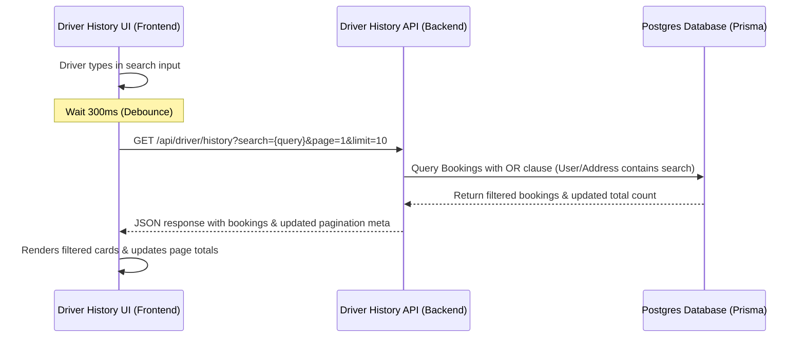

# Design Doc: Driver Trip History Page Search Option

This document details the approved design for introducing a search option to the driver's trip history page. This feature allows drivers to filter their past trips dynamically using passenger names, passenger phone numbers, and pickup/destination addresses.

---

## Architecture & Data Flow



---

## UI/UX Integration Plan

We will place the search bar below the top aggregate stats grid and above the active filters. This provides a neat hierarchical progression: summary statistics -> search & filter controls -> filtered list.

### 1. UI Elements & Layout (`app/driver/history/page.tsx`)
* **Placement**: Located between the stats grid and filters row.
* **Componentry**: A clean, premium text input styled with a search icon on the left, a spinner for active network queries, and a quick "clear" (`X`) button that appears when the input is not empty.
* **Localization**: The placeholder uses the centralized translation key `t("search_placeholder")` which maps to "Search..." / "খুঁজুন...".

### 2. State & Debouncing Logic
* **State variables**:
  * `searchQuery`: Bound directly to the text input for instantaneous typing updates.
  * `debouncedSearchQuery`: Synced with a 300ms debounce delay to throttle backend requests.
* **Effect Triggering**:
  * Changing search resets pagination (`page = 1`).
  * `apiFetch` includes `search` parameter only if it is a non-empty string.

---

## Backend Integration Plan

We will update the backend `GET` request in [app/api/driver/history/route.ts](file:///Users/patwary/Projects/CNGLagbe/app/api/driver/history/route.ts) to read the query parameter and filter DB rows using Prisma.

### Prisma query conditions
If the `search` query parameter exists and is non-empty:
```typescript
const search = searchParams.get("search");
if (search) {
  whereClause.OR = [
    { pickupAddress: { contains: search, mode: "insensitive" } },
    { destAddress: { contains: search, mode: "insensitive" } },
    {
      user: {
        OR: [
          { name: { contains: search, mode: "insensitive" } },
          { phone: { contains: search, mode: "insensitive" } },
        ],
      },
    },
  ];
}
```

---

## Verification & QA Checklist

* [ ] Typing search triggers the loading indicator inside the input box.
* [ ] Clearing the search bar fetches the original pagination set.
* [ ] Search works for:
  * Passenger Name (case-insensitive)
  * Passenger Phone Number (exact/partial match)
  * Pickup Address (case-insensitive)
  * Destination Address (case-insensitive)
* [ ] Changing active filter pills (Timeframe/Status) preserves search criteria, and vice-versa.
* [ ] Entering search text correctly resets the current page indicator to `1`.
