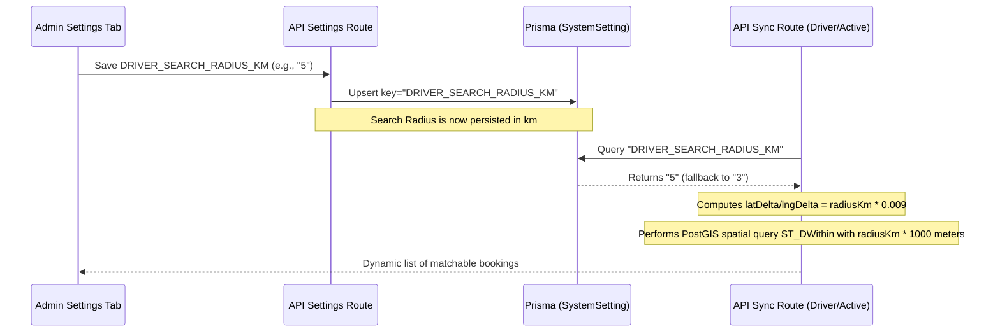

# Design Document: Dynamic Search Radius

## Goal
Make the driver search radius dynamic. Instead of using a hardcoded `3000` meters (3 km) threshold, the application will query the dynamic system setting `DRIVER_SEARCH_RADIUS_KM` from the database. It will fall back to `3` km if the setting is absent. Administrators will be able to edit this setting directly in the Admin Settings tab.

## Proposed Architecture



## Detailed Changes

### 1. Database Seeding (`prisma/seed.ts`)
Add a standard seed item for the search radius setting to ensure consistent baseline configurations:
```typescript
await tx.systemSetting.upsert({
  where: { key: "DRIVER_SEARCH_RADIUS_KM" },
  update: {},
  create: { key: "DRIVER_SEARCH_RADIUS_KM", value: "3" }
});
```

### 2. Backend Synchronization API (`app/api/sync/route.ts`)
Retrieve `DRIVER_SEARCH_RADIUS_KM` from the `SystemSetting` table and parse it as a float:
- Fallback: `3`
- Bounding Box: `latDelta = radiusKm * 0.009` and `lngDelta = radiusKm * 0.009`
- PostGIS Bounding check: `ST_DWithin(ST_MakePoint(b."pickupLng", b."pickupLat"), ST_MakePoint(${driver.currentLng}::float8, ${driver.currentLat}::float8), ${radiusKm * 1000})`

### 3. Admin Settings UI (`app/admin/components/tabs/SettingsTab.tsx`)
- Display the driver search radius input card/row below existing settings.
- Enforce valid range (`min="1" max="10" step="0.5"`).
- Wire to `handleUpdateSetting` callback to save changes in real time.

### 4. Translation Mappings (`constants/text.ts`)
Map appropriate labels and descriptions for both English and Bengali UI users:
- `driver_search_radius_title`: Driver Search Radius (km) / ড্রাইভার সার্চের রেডিয়াস (কিমি)
- `driver_search_radius_desc`: Configure the search radius in kilometers for matching drivers with passenger ride requests. / যাত্রীদের রাইড রিকোয়েস্ট ড্রাইভারদের কাছে পাঠানোর জন্য সার্চের সর্বোচ্চ দূরত্ব (কিলোমিটারে) নির্ধারণ করুন।

## Verification Plan

### Automated Checks
- Compile codebase and check for TypeScript errors (`npx tsc --noEmit`).

### Manual/Visual Verification
- Run a new DB seed and confirm `DRIVER_SEARCH_RADIUS_KM` is loaded.
- Load the Admin Settings panel, change Driver Search Radius to `5.5` km, and save.
- Verify through direct API query or dashboard synchronization that dynamic settings are read and applied appropriately.
