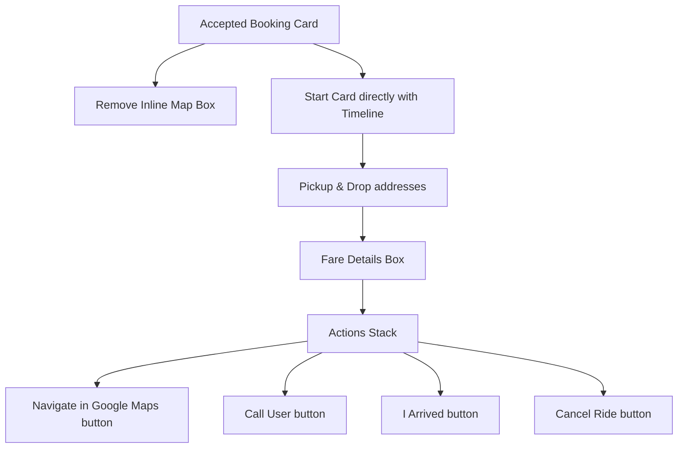

# Design Doc: Driver Ongoing Trip Map Removal

**Date**: 2026-05-21  
**Status**: APPROVED  

## 🎯 Goal
Simplify the driver's interface during active/ongoing trips (`ACCEPTED` or `PICKED_UP` states) by removing the inline Google Maps iframe preview. This eliminates clutter on mobile screens, optimizes performance, and keeps the UI ultra-clean and high-contrast. The driver can still easily navigate to the pickup or drop-off location via external navigation buttons that launch the native Google Maps mobile application.

---

## 🎨 Proposed UI/UX Layout Changes (Approach A)

### 1. ACCEPTED (En Route to Pickup) Card
* **Map Removal**: The full-bleed `<GoogleMapPreview>` component at the top of the card is removed.
* **Layout Adjustment**: 
  * The outer card spacing changes from full-bleed `p-0` to a padded `p-5` or `p-6` container.
  * Card corners remain a standard premium `rounded-[2rem]` (or `rounded-3xl`).
* **Vertical Timeline**: Placed at the top of the card directly below the card title. Shows Pickup ➜ Drop-off.
* **Navigation Placement**:
  * The pickup navigation link (`nav_pickup`) is kept under the pickup address.
  * A main external navigation button is added to the active actions section at the bottom of the card:
    * **Label**: "গুগল ম্যাপে নেভিগেট করুন" (Navigate in Google Maps)
    * **Action**: Opens external Google Maps routing.
    * **Variant**: Outline / Secondary `AppButton`.

### 2. PICKED_UP (Trip in Progress) Card
* **Map Removal**: The full-bleed `<GoogleMapPreview>` component at the top of the card is removed.
* **Layout Adjustment**:
  * Outer card uses standard padding `p-5` / `p-6`.
  * Visual timeline is placed directly at the top.
* **Navigation Placement**:
  * A main external navigation button is added to the action buttons:
    * **Label**: "গুগল ম্যাপে নেভিগেট করুন" (Navigate in Google Maps)
    * **Action**: Opens external Google Maps routing to the destination.
    * **Variant**: Outline / Secondary `AppButton`.

---

## 🔍 Visual Design Flow

---

## 🛠️ Verification Plan
* Validate all Next.js/React component code in `app/driver/dashboard/page.tsx`.
* Check that translations are correctly mapped for navigation button.
* Compile check via `npx tsc --noEmit`.
* Production build check via `npm run build`.
